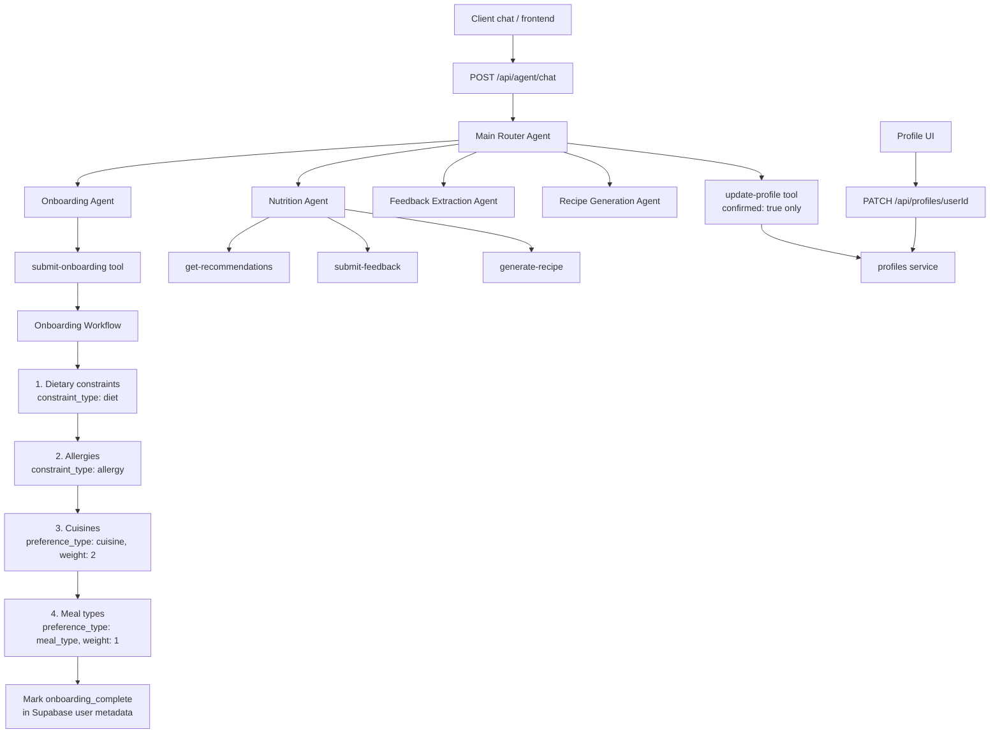
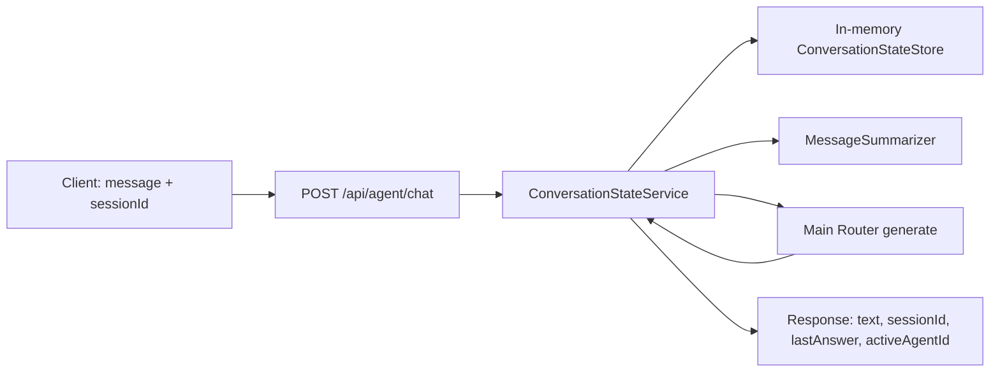

# GitFit-meal-recommendation


Meal/recipe personalization backend: deterministic ranking + constraint filtering,
LLM feedback extraction, schema-validated AI recipe generation, and a closed
feedback loop into preference weights.

## Setup

```bash
npm install
cp .env.example .env   # fill in Supabase + LLM keys
```

### Database

Apply the schema and seed data to your Supabase/Postgres project:

```bash
# via psql
psql "$DATABASE_URL" -f supabase/migrations/20260322000001_init_schema.sql
psql "$DATABASE_URL" -f supabase/seed/seed.sql

# or Supabase CLI
supabase db push
psql "$DATABASE_URL" -f supabase/seed/seed.sql
```

Demo user id after seeding: `00000000-0000-0000-0000-000000000001`

```bash
npm run dev
```

OpenAPI docs: `http://localhost:3000/ui`

Frontend client guide (request shapes, headers, screen flow): [docs/frontend/README.md](docs/frontend/README.md)

## Architecture

```
Hard constraints (SQL) → eligible recipes
User preferences (weights) → deterministic score + rank
Feedback comment → LLM extract → validate → upsert weights
Generate recipe → LLM structured output → Zod validate → store
```

Scoring and filtering are plain TypeScript/SQL — no LLM. AI is only used for
language understanding (feedback), content generation (recipes), and chat
routing/onboarding — always validated before being trusted.

### Agent router & onboarding workflow

`POST /api/agent/chat` hits a **main router** (Mastra supervisor agent). It
delegates to specialists and only writes profile data after explicit confirmation.
Onboarding uses a deterministic Mastra workflow to persist answers (every step
is skippable).



**Onboarding steps (chat or workflow input)** — empty arrays mean skipped:

| Step | Collects | Saved as |
|------|----------|----------|
| 1 | Vegan, Vegetarian, Gluten-free, Dairy-free | `POST` constraints `diet` |
| 2 | Free-text allergy tags | `POST` constraints `allergy` |
| 3 | Italian, Asian, Mexican, … | `POST` preferences `cuisine` (weight 2) |
| 4 | Breakfast, Lunch, Dinner, Snacks | `POST` preferences `meal_type` (weight 1) |

Profile changes from chat: router restates the patch → user confirms →
`update-profile` tool. Frontend can apply the same patch via
`PATCH /api/profiles/{userId}` (shared `updateProfile` service).

### Conversation state (backend-owned)

The frontend sends `{ message, sessionId? }` only. The server keeps a
`ConversationState` with **per-agent histories**, `lastAnswer`, and
`activeAgentId`. `MessageSummarizer` trims each history (recent window +
compressed summary) so context stays bounded. User-bound sessions require the
same `X-User-Id` or `userId` on follow-up requests.



| Field | Meaning |
|-------|---------|
| `histories[agentId]` | Recent messages + optional summary per agent |
| `lastAnswer` | Last user-facing reply (for yes/skip/ok follow-ups) |
| `activeAgentId` | Specialist context for the next turn |

## API surface

| Method | Path | Purpose |
|--------|------|---------|
| GET | `/health` | Health check |
| POST/GET/PATCH | `/api/profiles` | Profile CRUD |
| GET/POST/DELETE | `/api/constraints` | Hard constraints |
| GET/POST/DELETE | `/api/preferences` | Soft preference weights |
| GET | `/api/recipes` | Catalog |
| GET | `/api/recommendations?userId=` | Ranked recommendations |
| POST | `/api/feedback` | Ratings / comments → preference updates |
| GET | `/api/history/recommendations` | What was shown |
| GET | `/api/history/feedback` | Past feedback |
| POST/GET | `/api/generate` | AI recipe generation |
| POST | `/api/agent/chat` | Main router with server-owned session history |

Auth (optional):

- Set `API_KEY` and send `X-Api-Key`
- Prefer `X-User-Id` as trusted identity (must match body/query `userId` when both are sent)

## Project layout

- `src/services/` — business logic (recommendations, feedback, generation, …)
- `src/routes/` — OpenAPI Hono routes
- `src/mastra/` — agents, tools, and workflows (thin wrappers over services)
  - `agents/main-router-agent.ts` — supervisor entrypoint
  - `agents/onboarding-agent.ts` — 4-step skippable onboarding chat
  - `workflows/onboarding-workflow.ts` — deterministic persist + metadata flag
  - `conversation/` — `ConversationState`, `MessageSummarizer`, in-memory store
- `src/services/conversation.ts` — session orchestration (backend mutates history)
- `src/lib/scoring.ts` — deterministic scoring helpers
- `supabase/migrations/` — schema + `get_eligible_recipes` RPC
- `supabase/seed/` — demo recipes, user, constraints, preferences

## Spoonacular caching

Spoonacular is used **only for ingestion**. Once recipes are written to Postgres,
recommendations / scoring / feedback never call their API again.

```bash
# pull 20 random recipes into the local cache
npm run ingest:spoonacular -- --random 20

# cache specific Spoonacular ids (Get Recipe Information Bulk)
npm run ingest:spoonacular -- --ids 716429,715538

# search then hydrate + store
npm run ingest:spoonacular -- --search "pasta" --number 10 --diet vegetarian
```

HTTP equivalents (also in `/ui`):

- `POST /api/recipes/ingest/ids` `{ "ids": [716429, 715538] }`
- `POST /api/recipes/ingest/random` `{ "number": 10, "tags": "vegetarian" }`
- `POST /api/recipes/ingest/search` `{ "query": "pasta", "number": 10 }`

Each ingest call uses Spoonacular `information` / `informationBulk` (with nutrition),
normalizes into `recipes` + `recipe_attributes` + `recipe_ingredients` + categories,
and upserts on `(source_api, external_id)` so re-runs are idempotent.

## Scripts

```bash
npm run dev
npm run typecheck
npm test
npm run ingest:spoonacular -- --help
```

## Design notes

- Ranking never calls an LLM.
- Preference weights are capped at ±5 so feedback cannot dominate forever.
- Ratings/likes without comments still nudge weights from recipe attributes.
- Generated recipes are schema-validated and allergy-checked before storage.
